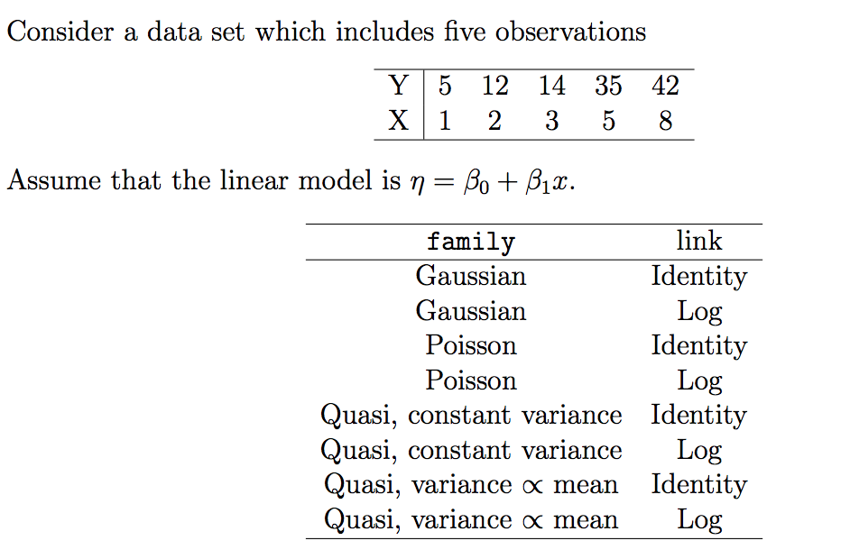

```{r setup, include=FALSE}
knitr::opts_chunk$set(echo = TRUE)
knitr::opts_chunk$set(cache = TRUE)
library(tidyverse)
```

#Correlation Coefficients 

##Pearson's $r$, Spearman's $r_s$, Kendall's $\tau$ 

-**Pearson's correlation coefficient** is a measure of linear correlation between two variables $X$ and $Y$. It has a value between +1 and −1, where 1 is total positive linear correlation, 0 is no linear correlation, and −1 is total negative linear correlation.  The formula when applied to a population is given by $$\rho_{X,Y} = \frac{cov(X,Y)}{\sigma_X\sigma_Y}$$ The sample Pearson's correlation coeffiecient $r$ can be calculated by plugging in estimates for the population parameters. $$r = \frac{\sum_{i=1}^n(x_i-\overline{x})(y_i-\overline{y})}{\sqrt{\sum_{i=1}^n(x_i-\overline{x})^2}\sqrt{\sum_{i=1}^n(y_i-\overline{y})^2}}$$
This formula aids the interpretation that the correlation is positive when both the $x_i$ and $y_i$ values lie above their their respective mean and negative when they lie on opposite side of their respective mean. The stronger this tendency is, the larger the magnitude of the correlation coefficient. 

-**Spearman's rank correlation coefficient** is defined as the Pearson correlation coefficient between the ranked variables and denoted $r_s$. To compute it on a sample of size $n$, first the raw scores $X_i,Y_i$ are transformed into their corresponding ranks in ascending order denoted $rgX_i,rgY_i$. In a bivariate sample,  each variable is ranked and the correlation is computed: $$r_s = \rho_{rg_xrg_Y}\frac{cov(rg_X,rg_Y)}{\sigma_{rg_x}\sigma_{rg_Y}}$$
The advantage of $r_s$ is that it can assess non-linear monotonic relationships between two variables. It will have a value of 1 is one variable is a strictly monotonic function of the other. For example, the dataset $\{(1,1),(2,4),(3,8),(4,16)\}$ is exponentially related and has the property $rgX_i = rgY_i$. Identical values are usually each assigned fractional ranks equal to the average of their positions in the ascending order of the values. However, if all the ranks are distinct integers, there is the formula $$r_s =1-\frac{6\sum d_i^2}{n(n^2-1)}$$ where $d_i = rg(X_i) - rg(Y_i)$ is the difference in ranks of an observation. Note that an important advantage of the Spearman Correlation is that it is less sensitive to outliers because Spearman's rho limits the outlier to the value of its rank.

-**Kendall's tau coefficient**

Let $(x_i,y_i)$ and $(x_j,y_j)$ be two distinct observations in a bivariate sample. Then the observations are *concordant* if the ranks for both elements agree: $y_i<y_j$ or if $x_i>x_j$ and $y_i>y_j$. The observations are *discordant* if the ranks disagree: $x_i<x_j$ and $y_i>y_j$ or if $x_i>x_j$ and $y_i<y_j$. The pair of observations is neither if the ranks are equal. The Kendall $\tau$ coefficient is defined as $$\tau = \frac{\text{(number of concordant pairs) - (number of discordant pairs)}}{n(n-1)/2}$$

Where the denominator is $\binom{n}{2}$: the number of pairs of observations in the sample, so $-1\leq \tau \leq 1$. An advantage of Kendall’s tau is that its interpretation in terms of the probabilities of observing the agreeable (concordant) and non-agreeable (discordant) pairs is very direct.Though in most of the situations, the interpretations of Kendall’s tau and Spearman’s rank correlation coefficient are very similar and thus invariably lead to the same inferences.
Spearman’s rank correlation coefficient is the more widely used rank correlation coefficient. Kendall's Tau may be less sensitive to error and give smaller values than Spearman's rho correlation, but the required number of computations for its calcualation can make implementation inefficient. 

References:

https://en.wikipedia.org/wiki/Pearson_correlation_coefficient
https://en.wikipedia.org/wiki/Spearman%27s_rank_correlation_coefficient
https://statistics.laerd.com/statistical-guides/spearmans-rank-order-correlation-statistical-guide.php
https://en.wikipedia.org/wiki/Ranking#Ranking_in_statistics
https://en.wikipedia.org/wiki/Kendall_rank_correlation_coefficient
http://www.statisticssolutions.com/kendalls-tau-and-spearmans-rank-correlation-coefficient/

---

##Comparing $r$, $r_s$, and $\tau$


```{r}

#organize observations into data frame
df <- data.frame(
  x_1 = rep(c(0,1,10), times = 2),
  x_2 = rep(c(0,1), each = 3),
  p = c(.1, .4, .2, .1, .1, .1)
)


n = 10^5
df.rows = nrow(df)

#sample from the row indices of the data frame
samples <- sample(1:df.rows, size = n, replace = TRUE, prob = df$p)

#create your sample by subsetting the data frame
my_sample <- df[samples,1:2]

knitr::kable(table(my_sample), caption = "Frequency table for sample from discrete bivariate")


get_cor <- function(my_method){
#function to get the 3 types of correlation coefficients
cor(my_sample$x_2,my_sample$x_1, method = my_method)
}

corrs <- c(pearson = get_cor("pearson"), spearman = get_cor("spearman"), kendall = get_cor("kendall"))

knitr::kable(data.frame(corrs))

```


```{r}
sample_mean <- function(x){
  weighted.mean(x, w = df$p)
}

df$rank_x1 <- rep(c(1,2,3),2)
df$rank_x2 <-  rep(c(1,2),each = 3)

sample_list <- list(x1_mean = df$x_1, x2_mean = df$x_2, rank_x1_mean = rep(c(1,2,3),2), rank_x2_mean = rep(c(1,2),each = 3))

means <- lapply(sample_list, sample_mean)

rank_df <- df %>% mutate(
  x1_star = x_1 - means[[1]],
  x2_star = x_2 - means[[2]],
  r1_star = rank_x1 - means[[3]],
  r2_star = rank_x2 - means[[4]],
  x_cov = x1_star * x2_star,
  r_cov = r1_star * r2_star
) %>%
 select(x_1, x_2, x_cov, r_cov, p)


```
---

##$r$ is positive but $r_s$ and $\tau$ are negative

**Pearson's correlation is positive because the outlier inflates the positive contribution to the covariance.**

To invstigate the covariance of the raw and the ranked data, observe this dataframe with the following transformed variables: x_cov = $(x_{i1}-\overline{x_1})(x_{i2}-\overline{x_2})$  and r_cov = $(rgx_{i1}-\overline{rgx_1})(rgx_{i2}-\overline{rgx_2})$ 

```{r echo = FALSE}
knitr::kable(rank_df)
```


Because the distribution of x_1 is skewed to the right, its mean is rather large. We can observe that the mode of the distribution x = (1,0), contributes positively to the covariance of the two variables. In the raw data, this contribution is rather high: an additional .75 for each (1,0) in our sample. Similarly the outlier (10,1) contributes  4.55 to the covariance, a large amount. However, the ranking the variables lowers the mean and reduces the effect of the outlier on the covariance. The mode (1,0) now has a negligble contribution of .03, and the contribution of largest magnitude isn't (10,1), but instead (0,1) with a negative contribution of -.77. This helps explain the negative value of Spearman's correlation. It is easy to see Kendall's correlation is negative because of the overwhelming number of discordant pairs of observations. 

---

## Construct a distribution where $r_s$ is negative but $\tau$ is positive

Notice a key difference between Kendall's $\tau$ and Spearman's $\rho$ is that the former is not sensitive to the distance between rank swaps, just their frequency. This can be illustrated using a discrete distribution of distinct integers that allows us to use the shortcut formula for $r_s$. 


```{r}
x1 <- 1:80
x2 <- c(80:70,11:69,10:1)
cor(x1, x2, method = "spearman")
cor(x1, x2, method = "kendall")
plot(x1,x2)
```

We can see that Spearman's correlation is negative because of the weight of $\sum d_i^2 = (80-1)^2 + (79-2)^2 + ...$ is very large. Kendall's tau is not sensitive to this fact, and shows a positive correlation because of the many concordant pairs in the middle of the distribution. 

#Implementing GLM's

##Specifying the GLM in R

Models in `R` can be specified using a compact formula syntax `y ~ model` where `y` is the response variable we want to measure and `model` specifies the formula we fit to the data. Consider a regression model where we want to predict `y` from $p$ predictors: $x_1, ..., x_p$. Different operators will specify how we include these predictors as terms in the model:

* `+`   `x_1 + x_2` indicates a linear combination of the variables
* `:`   `x_1:x_2` includes the interaction term $x_1x_2$ in the model
* `*`   `x_1 * x_2` denotes a factor crossing: $x_1 + x_2 +x_1x_2$
* `^`   `(x_1 + x_2 + x_3)^2` expands to a formula including the main effects of $x_1, x_2, x_3$ and their second order interation terms
* `-`   `-1` removes the intercept term
* `I`   `I(x_1^2)` inhibits the conversion to `x_1*x_1` which reduces to `x_1` since formulas remove reduntant terms. Using `I` properly introduces the term $x_1^2$ to the formula


To fit a general linear model in `R`, we use the `glm` function and supply the model formula to the `formula` argument. The family name such, as binomial, gaussian, or poisson, can be supplied to the family argument as a family object. The default link is used unless an alternative is specified within the family object. For example, `glm(formula, family=binomial(link=probit))` uses the probit link function.

## Specifying the Link Function

Consider a dataset which includes two observations:


```{r}
df <- data.frame(Y = c(1,4),
                 X = 1:2) 
```

Let's assume the linear model is $\eta=\beta c$ and the family is gaussian. We can estimate the coefficients $\beta$ using different link functions. Here we write a function that generates models from this data using different links. A table of the coefficients of each model is provided below. 

```{r}
glm.mod <- function(.link){
  glm(formula = Y ~ ., family = gaussian(link = .link), data = df)
}

links <- c("identity","log","inverse")

model.list <- map(links, glm.mod)

coef.list <- map(model.list, coef) %>% as.data.frame()

names(coef.list) <- links

row.names(coef.list) <- c("Intercept", 'X')


knitr::kable(coef.list, row.names = TRUE, caption = "Coeffecients for each of 3 fitted models")
```

##Specifying your own link function

```{r}
explink <- function()
{
    linkfun <- function(mu) exp(mu)
    linkinv <- function(eta) log(eta)
    mu.eta <- function(eta) 1/eta
    valideta <- function(eta) TRUE
    link <- "exponential"
    structure(list(linkfun = linkfun, linkinv = linkinv,
                   mu.eta = mu.eta, valideta = valideta, name = link),
              class = "link-glm")
}

explink.mod <- glm(Y ~ X - 1, family=gaussian(link=explink()), data = df)
explink.mod

beta.mod <- coef(explink.mod)
```

Using this link our estimate of $\beta$ is `r beta.mod`. 

# Quasi-likelihood and the Generalized Linear Model

## Implementing quasi-likelihood in R


- `quasi` is a function that generates a family object containing a list of functions and expressions that can be used by `glm` and `gam`. It accepts two main arguments `link` and `variance`, which default to "identity" and "constant" if not specified. 

1. The `quasi` family accepts the following links: `logit`, `probit`, `cloglog`, `identity`, `inverse`, `log`, `1/mu^2`, and `sqrt`

- The `power` function creates a link object based on the link function $\eta = \mu^{\lambda}$, where the argument for $\lambda$ is a real number. If $\lambda < 0$ it is taken to be $0$, and the log link is obtained. The default `lambda = 1` gives the identity link.

2. The variance argument accepts a character string that names the variance function to use with the `quasi` function. You can specify one of the following: `mu(1-mu)`, `mu`, `mu^2`, `mu^3`. Furthermore, the variance function is specific to the `quasi` function; other family functions have a fixed variance function and do not accept this parameter. 

## Comparing different models



```{r}
my_data <- data.frame(
  x = c(1, 2, 3, 5, 8),
  y = c(5, 12, 14, 35, 42)
)


model_constructor <- function(family_object){
  glm(y ~ x, family = family_object, data = my_data)
}

family_objects <- list(gaussian,
                       gaussian(link = 'log'),
                       poisson,
                       poisson(link = 'log'),
                       quasi,
                       quasi(link = 'log'),
                       quasi(variance = 'mu'),
                       quasi(link = 'log', variance = 'mu')
                       )

my_8_models <- map(family_objects, model_constructor)

names(my_8_models) <-  c("g", 'gl', 'p', 'pl', 'q', 'ql', 'qmu', 'qlmu')

summaries <- map(my_8_models, summary)


```

Let's examine the output of the gaussian model using the `summary` function

```{r}
summaries[[1]]
```

The goodness-of-fit of a glm model is described by the Null deviance,  Residual deviance, and AIC metrics, where low values indicate a better fit. Let's compare the fit of our models.

```{r}
model_fits <- map(my_8_models, extract, c("deviance", "null.deviance", "aic")) %>% transpose() %>% map(unlist) %>% as_tibble() %>% cbind(names(my_8_models)) %>% rename(names ="names(my_8_models)")
knitr::kable(model_fits)
```


Let's see which models performed best and worst under each metric:

```{r}
knitr::kable(model_fits %>% select(deviance, names) %>% arrange(deviance))
```

The quasi-likelihood with variance proportional to mean has the lowest deviance, whereas the quasi-likelihood with log link has the highest. 


```{r}
knitr::kable(model_fits %>% select(null.deviance, names) %>% arrange(null.deviance))
```

The null deviance is an even split, half the models performed well and the other half did not.

```{r}
knitr::kable(model_fits %>% select(aic, names) %>% arrange(aic))
```

It looks like the standard gaussian with identity link has the lowest aic, a metric which is not avaialable for quasi likelihoods. 

## Wedderburn's Quasi likelihood and Nelder's extension

Quasi-likelihood estimation is one way of allowing for overdispersion, that is, greater variability in the data than would be expected from the statistical model used. It is most often used with models for count data or grouped binary data, i.e. data that would otherwise be modelled using the Poisson or binomial distribution. Instead of specifying a probability distribution for the data, only a relationship between the mean and the variance is specified in the form of a variance function giving the variance as a function of the mean.Wedderburn relaxes the assumption of a known variance function of $y$ by allowing an unknown constant of proportionality $\phi$  so that $var(y) = \phi V(\mu)$. This $\phi$ is known as the *dispersion* parameter and does not alter the estimation of the regression coefficients $\beta$. Wedderburn defines this quasi-likelihood function for an observation $y$ with mean $\mu$ and variance $V(\mu)$ as $$Q(y; \mu) = \int^{\mu}\frac{y-\mu}{V(\mu)}d\mu$$ The likelihood of the sample of $N$ observations is $\sum_{i=1}^NQ(y_i,\mu_i)$. 

Nelder defines an extended likelihood function $$Q^+(y; \mu) = -\frac{1}{2}log\{2\pi\phi V(y)\} - \frac{D(y;\mu)}{\phi}$$ where $D$ is the deviance function, and $\phi$ is the nuisance parameter. The estimates of $\beta$ obtainted by maximizing $Q^+$ are the same as those from maximizing $Q$ and the estimate of $\phi$ obtained from maximizing $Q^+$ is $\hat{\phi} = D(y;\hat{\mu})$.

References: 

- *An Extended Quasi-Likelihood Function* Nelder, Pregibon (1987)
- [Wikipedia: Quasi-Likelihood](https://en.wikipedia.org/wiki/Quasi-likelihood)
- [R documentation: power function](https://www.rdocumentation.org/packages/stats/versions/3.4.1/topics/power)
- [R documentation: Family Objects for Models](http://stat.ethz.ch/R-manual/R-devel/library/stats/html/family.html)

